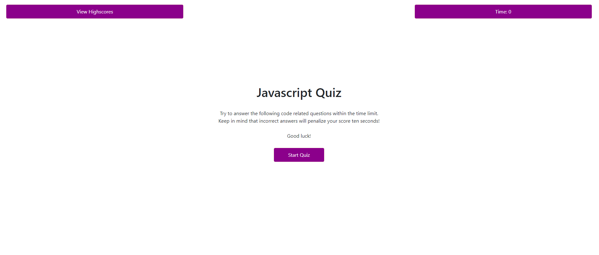
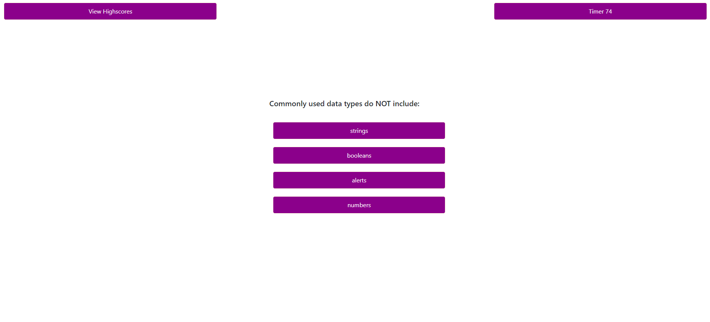
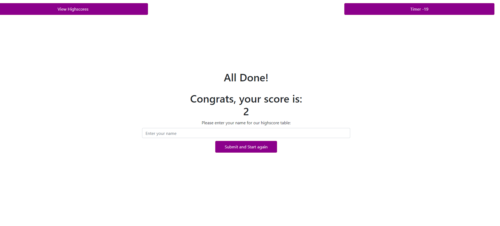

# Timed-Quiz

Application that generates a timed quiz and saves User Name and Highscore.
 
 
## Table of contents
* [General Info](#General-Info)
* [Technologies](#Technologies)
* [Screenshot](#Screenshot)
* [Setup](#Setup)
* [Improvments](#Improvments)

 

### General Info

Application that generates a quiz with five questions related to JavaScript. 
This app runs in the browser on a single html and features dynamically updated HTML and CSS powered by JavaScript code. 
It also features a clean and polished user interface and be responsive, ensuring that it adapts to multiple screen sizes.
The quiz is timed.
User Name and Score / Result of the quiz are locally stored.

 

### Technologies
<ul>
<li>Javascript
<li>CSS
<li>HTML
</ul>

 

### Screenshots 

 

#### Start Page

#### Quiz Page

#### Result Page

 

### Setup

When on start page (see screenshot) user will be prompted to start the quiz.

Once all qustions are answered, the user will be directed to the result page which displays his score.
The User can also enter his name and start again.

   
### !Improvments!

This application still needs improvment and debugging in the following aspects:
<ul>
<li>Storage of Username
<li>Display of Highscore
<li>Debugging when last question is generated
<li>Replacing of the alert with a different html input i.e. sound for correct or incorrect answers
<li>Layout Upgrade and improved user expierence
</ul>
